# The Ummah's 200-Year Plan

## A Civilizational Blueprint, Built to Outlast Any of Us

> *"كَيْفَ تَكُونُ الْأُمَّةُ بَعْدَنَا؟"*
> *"What will the Ummah be after us?"*

This document is written for an audience the writer will not meet — Muslims of 2126, 2176, 2226. It is a plan written **by one generation for the use of seven**.

It is also written **for our own generation** — to free us from the illusion that any single founder, organization, government, or technology can carry the Ummah's future. They cannot. Civilizations are built by **institutions that outlive their builders**, and that is what this document plans for.

This plan does not depend on the founder of the Ummah AI Initiative remaining alive, active, or even present. If everyone named in current operational documents is gone tomorrow, this plan continues — because the plan is **civilizational, not personal.**

---

## I. The Reality Right Now (2026)

We start with what is true. Without this, no plan is honest.

### Active atrocities against Muslim civilians

- **Gaza** — ongoing AI-targeted military campaign with documented civilian casualties at industrial scale. Lavender, Where's Daddy, and successor systems set the template for AI warfare against civilian populations. The ICJ genocide case is active.
- **Xinjiang** — over a million Uyghurs held in internment, AI-tuned facial recognition specifically classifies them, forced labor in supply chains of major Western brands.
- **Kashmir** — sustained occupation, communications blackouts, AI surveillance, demographic engineering.
- **Rohingya** — displaced; ongoing genocide unresolved; statelessness institutionalized.
- **Sudan** — civil war with regional proxy fueling.
- **Yemen** — humanitarian catastrophe sustained by external arms flows.
- **Syria, Iraq, Libya** — fragmented states, ongoing instability, Muslim populations bearing the costs of decades of intervention.

### Structural conditions affecting all 1.8 billion Muslims

- **Algorithmic suppression** of Muslim voices on every major platform — documented by HRW, BSR, 7amleh, AlgorithmWatch.
- **Surveillance dragnet** — Western counter-terrorism programs (Prevent in UK, equivalents elsewhere) disproportionately surveil Muslim communities.
- **Economic subjugation** — Muslim-majority nations remain net commodity exporters and net debtors; elite capture in many; sanctions weaponized routinely.
- **Educational dependency** — elite education in Muslim countries primarily routes through Western universities, shaping a leadership class often disconnected from Islamic scholarly tradition.
- **Linguistic erosion** — Arabic, Urdu, Bahasa, Bengali, Turkish, Persian increasingly secondary to English in elite/professional life within Muslim-majority states.
- **Information dependence** — Muslim narratives mostly distributed via Meta, X, TikTok, YouTube, Google — none Muslim-owned or accountable.
- **Technological dependence** — near-zero Muslim ownership of frontier AI, compute, cloud, chips, satellite infrastructure, biotech.
- **Demographic pressure** — Muslim populations rising; Muslim political power not rising proportionally; climate pressure on Muslim-majority regions disproportionate.
- **Climate catastrophe** — South Asia, MENA, parts of Africa among the most climate-affected. By 2050, hundreds of millions of Muslims will face displacement-grade climate stress.
- **AGI horizon** — frontier AI within decades of capabilities that could either liberate or render permanent the imbalances above. None of those frontier systems are Muslim-owned.

### What is NOT happening

- No coordinated Muslim-world response to AI-era infrastructure dependency.
- No multi-generational planning visible at OIC or any major Muslim institution.
- No serious sovereign tech, sovereign compute, or sovereign AI capacity at scale.
- No comprehensive evidence preservation for AI-era atrocities.
- No legal-accountability infrastructure tuned for these specific harms.
- No major effort to preserve scholarly tradition in machine-readable form across schools.
- Limited coordination between Muslim-majority states (factionalism, competing axes — Saudi/Iran/Turkey/Pakistan/Indonesia/Malaysia each pursuing separate paths).
- Limited diaspora-homeland coordination beyond sentiment.

### Honest naming

Every prior generation of Muslims, looking back from disaster, asked: "How did our forebears not see this coming?" The honest answer was usually: **they saw it. They were unable or unwilling to organize against it.** We are at risk of the same.

This plan is the attempt at willingness, organized.

---

## II. The Trajectory if Nothing Changes

If current trends continue without organized response, here is what 2126 likely looks like for the Ummah.

### 2050 — within current children's lifetimes

- AI-driven surveillance has become **the normal condition** of Muslim life globally. Privacy as currently understood ceases to exist for most.
- Muslim populations in Western countries face institutionalized algorithmic discrimination in employment, housing, banking, immigration. Some explicitly coded; most invisible.
- Several Muslim-majority countries have experienced state collapse or sustained conflict driven by climate-related water/food crises.
- Arabic and other Muslim languages are technically secondary in their own homelands' professional/elite life.
- The classical Islamic scholarly tradition is **digitally accessed primarily through Western-controlled AI systems**, which have algorithmically shaped what the next generation believes Islam to teach.
- A generation of scholars trained in classical methodology has died; their knowledge is fragmented across YouTube videos and obsolete digital formats.

### 2100 — within current children's grandchildren's lifetimes

- Climate displacement has redistributed hundreds of millions of Muslims; many in stateless or semi-stateless conditions.
- Islamic knowledge is curated and presented by AGI systems whose alignment was set by non-Muslims; "Islam" the children of 2100 know is whatever those systems output.
- Practice of Islam has continued in pockets but contracted significantly in cosmopolitan / urban life globally.
- Muslim political power has not consolidated; Muslim economic power remains concentrated in petro-rentier states whose viability has declined.
- Surveillance capitalism + post-AGI labor displacement has created a planetary-scale dependency relationship between Muslim labor and non-Muslim capital.
- A "Muslim identity" persists culturally; a Muslim civilization in the historical sense — with autonomous institutions, knowledge production, governance — does not.

### 2150 — within current children's great-grandchildren's lifetimes

- Whatever Ummah remains is determined by decisions made between 2026 and 2076.

This is the trajectory of doing nothing different. **Nothing about this is fated.** Every previous catastrophic civilizational decline was avoidable in retrospect. So is this one.

But avoiding it requires planning at a horizon longer than any individual founder, election cycle, or quarterly metric.

---

## III. What the Ummah Must Possess by 2226

Working backward from a thriving Ummah of the 23rd century, here is the **minimum civilizational infrastructure** required. We name it now so we can begin building it.

### The Twelve Pillars

```mermaid
flowchart TB
    subgraph Inner[The Ummah of 2226]
        direction TB
        K[1. KNOWLEDGE<br/>scholarly tradition alive,<br/>taught, evolving]
        L[2. LANGUAGE<br/>Arabic + Muslim languages<br/>technologically vital]
        E[3. ECONOMY<br/>self-sufficient<br/>halal economy at scale]
        T[4. TECHNOLOGY<br/>own AI, compute, chips,<br/>cloud, satellites]
        I[5. INFORMATION<br/>own platforms,<br/>distribution, narrative]
        D[6. DEFENSIVE<br/>counter-surveillance,<br/>evidence, accountability]
        G[7. GOVERNANCE<br/>nations accountable<br/>to populations]
        C[8. CLIMATE<br/>resilience to ecological<br/>catastrophe]
        F[9. FAMILY<br/>continuity of practice<br/>across generations]
        R[10. RELATIONS<br/>diplomacy with other<br/>civilizations]
        S[11. SPIRITUAL<br/>actual religious life<br/>and worship]
        A[12. AGI<br/>resilience to artificial<br/>superintelligence]
    end

    style Inner fill:#f0f9f0
```

Each pillar requires its own century-spanning effort. Each is necessary; none is sufficient alone.

### Pillar 1 — Knowledge (`'ilm`)

**The standard:** the classical Islamic scholarly tradition — across Sunni, Shia, Ibadi schools — remains alive, taught, and evolving in 2226. Every major work from Al-Tabari to Mufti Taqi Usmani is available in machine-readable, citable, scholar-verified form. New scholarship continues in continuity with the tradition. Madaris produce 'ulama recognizable to the past five centuries' standards.

**What must be built:**

- Comprehensive digital corpora of every major Muslim scholarly work, with provenance, multiple translations, scholar verification.
- Tools (like Basira) that surface this knowledge accessibly without flattening it.
- Madrasa systems that combine classical training with modern epistemic tools.
- Scholarly succession — every century produces 'ulama capable of teaching the next.
- Evaluation standards that prevent AI-mediated drift from the tradition.

**Threats over 200 years:**

- Knowledge collapse if scholars die without successors in the digital age.
- Knowledge mediation by Western AI that subtly reshapes what is "Islam."
- Sectarian fragmentation that prevents unified preservation.

**Status 2026:** Initial. Basira and analogous projects begin this work. Far from sufficient at scale.

### Pillar 2 — Language

**The standard:** Arabic, Urdu, Bahasa, Malay, Bengali, Turkish, Persian, Hausa, Swahili, and other Muslim languages remain **fully technologically capable** in 2226 — supporting AI, governance, science, art, commerce — without being lossy translations of English-original content.

**What must be built:**

- Native AI / NLP infrastructure for every Muslim language above the level Western models provide.
- Educational systems that maintain native-language proficiency in elite + technical fields.
- Creative production (literature, film, software) in these languages, not just translated.
- Lexicons that keep pace with technological + scientific change.
- Active use in international scholarly + diplomatic life.

**Threats:**

- Diglossia — formal language used only in religious contexts; technical/elite life in English.
- AI homogenization to English-trained statistical norms.
- Cultural shame about non-elite languages.

**Status 2026:** Critical gap. Almost all frontier AI poorly serves Muslim languages.

### Pillar 3 — Economy

**The standard:** Muslim-majority economies are **net producers of value**, not solely commodity exporters. The halal economy is a serious global category, not a niche. Islamic finance is mainstream, not novel. Muslim labor is not commodified into a global underclass.

**What must be built:**

- Productive industry across Muslim-majority countries (manufacturing, technology, biotech, etc.).
- Islamic finance scaled to be a genuine alternative to interest-based finance, with sovereign-fund participation.
- Halal supply chains spanning agriculture to retail.
- Skill development that produces Muslim engineers, scientists, scholars at scale.
- Coordination among Muslim economies to reduce dependency.
- Resistance to debt-trap dynamics imposed by international finance.

**Threats:**

- Dollar-system entrenchment + sanctions weaponization.
- Resource curse perpetuating rentier economies.
- AI-driven labor displacement disproportionate in developing economies.
- Climate crisis hitting agricultural economies hardest.

**Status 2026:** Some islands of capability (UAE, Malaysia, Indonesia, parts of Turkey, Saudi vision-2030 efforts). No coordinated Ummah-level economic strategy.

### Pillar 4 — Technology

**The standard:** by 2226, Muslims own and operate full-stack technological infrastructure — chips, compute, cloud, AI models, robotics, biotech, space, energy — sufficient that no single non-Muslim power can switch off Muslim digital life.

**What must be built:**

- Chip fabrication capacity in at least 2-3 Muslim-majority jurisdictions.
- Foundational AI labs producing frontier models.
- Sovereign cloud infrastructure spanning multiple jurisdictions.
- Satellite communications independent of Western or Chinese networks.
- Biotech / pharmaceutical production capacity.
- Research capacity (universities, labs) producing original work.
- Standards bodies where Muslims have voice.

**Threats:**

- Export controls preventing chip access (already happening for non-aligned states).
- Brain drain of Muslim technologists to Western firms.
- Patent / IP regimes locking out follow-on innovation.

**Status 2026:** UAE / Saudi making moves; Malaysia / Indonesia / Pakistan / Turkey / Egypt nascent. No single Muslim country has full-stack capacity. Coordination near zero.

### Pillar 5 — Information

**The standard:** by 2226, Muslims have **media infrastructure they own** — social platforms, distribution networks, search, video — through which the Ummah's narratives reach the Ummah and the world without algorithmic interference by hostile or indifferent parties.

**What must be built:**

- Social platforms with significant Muslim user bases not subject to Meta-style algorithmic suppression.
- Search engines that index Muslim content fairly.
- Video / streaming infrastructure for Muslim creative work.
- Funding for journalism that serves Muslim publics.
- Cultural production (film, literature, games, music where halal) that meets global standards.

**Threats:**

- Network effects that make existing platforms hard to replace.
- Government censorship in Muslim-majority states themselves.
- AI-generated content drowning authentic voices.

**Status 2026:** Al Jazeera and TRT have some reach. Otherwise minimal. No Muslim-owned globally-significant social platform.

### Pillar 6 — Defensive

**The standard:** by 2226, Muslims have **infrastructure to document harms, defend the targeted, and hold perpetrators accountable** — operating across jurisdictions, surviving political pressure, and equipping ordinary Muslims with the tools they need to remain safe.

**What must be built:**

- Permanent atrocity archives (Shahid and successors) that survive across centuries.
- Counter-surveillance tools in every Muslim language.
- Legal infrastructure capable of pursuing accountability across jurisdictions.
- Independent platforms documenting algorithmic injustice (Mizan and successors).
- Networks between human rights organizations, journalists, scholars, lawyers.

**Threats:**

- State-level pressure on archives.
- Funding instability.
- Capture by sectarian or nationalist agendas.

**Status 2026:** Initial. The defensive projects in this initiative (Shahid, Hisn, Mizan) are seedlings.

### Pillar 7 — Governance

**The standard:** by 2226, Muslim-majority states are governed in ways accountable to their populations — not as Western liberal democracies necessarily, but as systems where the population can replace failed leaders, justice exists, corruption is bounded.

**What must be built:**

- Institutional capacity in Muslim-majority states beyond strong-man rule.
- Civic infrastructure: bar associations, professional bodies, civic organizations.
- Educational systems producing leaders who serve their populations.
- Mechanisms for Ummah-wide coordination (post-OIC institutions that work).
- Fiqh of governance that adapts to modern conditions while honoring tradition.

**Threats:**

- Cycle of authoritarianism + revolution + recapture.
- Foreign manipulation of Muslim politics.
- Sectarian fragmentation preventing coordination.

**Status 2026:** Mixed. Some states stable; many fragile. Ummah-level coordination weak. **This pillar is mostly outside the scope of a tech initiative**, but tech initiatives must understand they exist in this context.

### Pillar 8 — Climate

**The standard:** by 2226, Muslim populations have **adapted to and helped lead response to** the climate crisis, with sufficient agriculture, water, energy, and migration support that no Muslim region becomes uninhabitable for Muslim populations.

**What must be built:**

- Agricultural research and production tuned to Muslim-majority regions.
- Water security infrastructure (desalination, reuse, ground-water management).
- Energy transition led by Muslim-majority sun-rich nations (solar, hydrogen, etc.).
- Climate-adaptive cities that absorb climate migrants.
- International negotiation power for climate finance.
- Migration corridors and integration mechanisms.

**Threats:**

- Climate impacts arriving faster than adaptation.
- Wealthier nations closing borders to Muslim climate refugees.
- Resource conflicts among Muslim states.

**Status 2026:** Critical gap. Climate-vulnerability of Muslim populations not matched by climate-response infrastructure.

### Pillar 9 — Family

**The standard:** by 2226, Muslim children continue to be raised Muslim — receiving the practice, scholarship, language, and identity of the tradition — in sufficient numbers and with sufficient depth that the Ummah continues as a recognizable civilization.

**What must be built:**

- Educational infrastructure (madaris, Islamic schools, supplementary programs) that combines tradition with modern competence.
- Family-supporting public policy in Muslim-majority states.
- Marriage and family networks that work across diaspora and homeland.
- Cultural production for Muslim children (children's media, literature, games) that competes with global mass culture.
- Religious literacy among Muslim parents themselves (so they can pass on what they don't yet hold).

**Threats:**

- Modernity's homogenizing pressure on family forms.
- Economic stress preventing family formation.
- Cultural distance between religiously-educated grandparents and digitally-native grandchildren.

**Status 2026:** Mixed. Strong in some communities; eroding in others.

### Pillar 10 — Relations (with other civilizations)

**The standard:** by 2226, the Ummah engages with Christian-majority, Hindu-majority, Buddhist-majority, secular, and other civilizations as **neither petitioner nor conqueror** — as a peer.

**What must be built:**

- Diplomatic capacity beyond petro-state checkbook.
- Knowledge of and respect from other civilizations' scholarly traditions.
- Trade and cultural exchange that benefits both sides.
- Coalition-building on shared challenges (climate, AGI, biotech ethics).
- Reduction of inter-civilizational hostility through sustained engagement.
- Strong defense capability such that hostility against the Ummah is costly.

**Threats:**

- Ongoing military hostility from specific civilizational blocs.
- Defensive isolationism from within the Ummah.
- Civilizational stereotypes hardened by media on all sides.

**Status 2026:** Highly variable. Some Muslim states have strong relations; the Ummah as a whole is often perceived as a threat / problem.

### Pillar 11 — Spiritual

**The standard:** by 2226, the actual practice of Islam — the daily prayers, fasting, charity, pilgrimage, dhikr, scholarship, communal worship — is **alive and rich** among Muslims globally. The Ummah is not just culturally Muslim; it is Muslim.

**What must be built:**

- Mosques and prayer infrastructure adapted to changing demographics.
- Hajj infrastructure scaled and managed for billions of Muslims over time.
- Sunnah-aligned daily life supported by technology rather than displaced by it.
- Tasawwuf / spiritual discipline traditions preserved and accessible.
- Religious education for every Muslim, not just the religious class.
- Resistance to nihilism, materialism, and the spiritual flattening that secular modernity tends toward.

**Threats:**

- Secular drift in Muslim populations.
- Ritual emptied of meaning.
- AGI-mediated mass leisure displacing religious practice.

**Status 2026:** Mixed. Strong religious life among some populations; declining in others.

### Pillar 12 — AGI / Superintelligence Resilience

**The standard:** by 2226, whatever artificial intelligence has come into being — narrow, general, super, or otherwise — does not subordinate the Ummah's agency. The Ummah has a voice in setting AI's direction, has tools to defend against AI-enabled coercion, and has built scholarly capacity to engage AI's questions on the tradition's terms.

**What must be built:**

- Muslim AI safety research — not just downstream of Western AI safety but contributing to it.
- Fiqh of AI — scholarly engagement with what AI is permitted to do, what it is not, what its rights and obligations are if any.
- Defensive AI infrastructure: detection of AI-enabled manipulation, deepfakes, surveillance.
- Constitutional limits on AI in Muslim-majority states.
- Coalition-building with non-Muslim AI safety researchers globally.
- Sufficient AI capability that "ban it" is not the only Muslim option.

**Threats:**

- AGI arrives before Muslim capacity exists; subsequent dynamics set by others.
- AI-enabled mass manipulation converts Muslim populations against their tradition.
- AI-enabled weapons used to enforce particular settlements of geopolitical questions.

**Status 2026:** Beginning. The current initiative is a small part of this pillar.

---

## IV. The Method — How Civilizations Actually Get Built

A 200-year plan is meaningless without a theory of how it actually operates. We do not assume founder-driven heroics. We assume **institutions**, distributed, self-renewing.

### What we learn from civilizations that lasted

**Al-Azhar (founded 970 CE, ongoing):** survived Fatimid → Ayyubid → Mamluk → Ottoman → colonial → modern Egyptian transitions because:
- Waqf-funded (independent of any single ruler).
- Trained its own successors generation after generation.
- Substance valued (scholars produced respected work).
- Adapted methodologies while keeping core (Sunni-ization after Fatimids; modern reforms in 19th-20th c.).

**The Catholic Church (founded ~1st c. CE, ongoing):**
- Multiple geographic centers (Rome, regional bishops).
- Codified internal succession (canon law).
- Education infrastructure (monasteries, universities) producing leadership.
- Theological core that adapts methodology but preserves essence.
- Property base and financial independence.

**Jewish diaspora institutions (~70 CE - present):**
- Distributed (no central authority required).
- Knowledge as portable infrastructure (Talmudic study reproducible anywhere).
- Inter-community coordination through scholarly and family networks.
- Adaptation to host cultures while preserving identity.

**The Islamic golden age institutions (Bayt al-Hikmah etc.):**
- Open knowledge culture.
- Cross-community collaboration (Muslim, Christian, Jewish scholars).
- Patronage diversified across Caliphal + private + waqf sources.
- Meritocratic — best scholars surfaced regardless of background.

### What we learn from what fails

**Dynastic empires that fell:** depended on charismatic leadership; failed when succession failed.

**Top-down reform movements:** Tanzimat-era Ottoman reforms, Atatürk-era Turkish reforms — depended on individual leaders; ambivalent legacies.

**Pure ideological movements:** burned bright, faded fast.

**Single-source-funded institutions:** ended when the funder did.

### The principles that follow

Civilizations that last share these patterns. We adopt them as the operating principles of the 200-year plan.

1. **Distribute everything.** No single point of failure — geographic, institutional, financial, intellectual.
2. **Make institutions outlast their founders.** Built so the founder's death does not affect operations.
3. **Train successors continuously.** Every generation produces the next.
4. **Diversify funding to perpetuity.** Waqf, fees, partnerships, multiple state and private sources.
5. **Preserve substance; adapt methodology.** Core unchanging; means evolving.
6. **Cultivate genuine excellence.** Mediocre institutions die. Excellent ones get protected.
7. **Open networks beat closed cabals.** Coalition-building outperforms purity-testing.
8. **Document everything.** Future generations need to know what we knew and why.
9. **Mostly invisible.** The institutions that last are usually not flashy. Boringness is durability.
10. **Plan beyond your lifetime.** Decisions evaluated by 100-year impact, not 10-month.

---

## V. The Four-Generation Plan

Aligning with the twelve pillars and the twelve principles, here is the temporal structure.

### Generation 1 — Foundation (2026 – 2050)

**Goal:** Establish initial nodes in every pillar. Many will be small; their existence matters more than their scale.

**By 2050:**

- Multiple Muslim-built AI initiatives operating (Basira, others) with shared open standards.
- First permanent atrocity archives (Shahid, others) operating across jurisdictions.
- Counter-surveillance toolkits broadly distributed (Hisn and successors).
- Multiple sovereign Arabic + Muslim-language LLM efforts operational.
- Significant Islamic finance presence in global capital markets.
- Halal economy organized as a recognizable global category.
- Demographic — Muslim populations growing; political organization adapting.
- Climate adaptation programs in 5+ Muslim-majority countries.
- Scholarship — major classical works fully digitized and verified across schools.
- Multi-jurisdiction coalition of Muslim-tech and Muslim-civil-society organizations operating.

**This is the planting generation.** What we do is not visible at scale. It is the seedbed.

### Generation 2 — Construction (2050 – 2075)

**Goal:** Take the seedlings of Generation 1 and build them into recognizable institutions of significant scale.

**By 2075:**

- Muslim AI labs at frontier-comparable scale.
- Sovereign chip + compute capacity in 2-3 Muslim-majority countries.
- Muslim social/distribution platforms with hundreds of millions of users.
- Halal economy at significant percentage of global GDP.
- Muslim-coordinated climate response (water sharing, agricultural research, migration coordination).
- Scholarly tradition vibrant — multiple new generations of 'ulama trained on rich digital and traditional infrastructure.
- Atrocity archives mature — citations standard in international legal proceedings.
- Counter-surveillance infrastructure mainstream within Muslim journalism / activism.
- AGI alignment research with serious Muslim contribution.
- Madrasa systems that produce both classical 'ulama and AI-fluent technologists.

**This is the building generation.** What was planted starts to produce visible structure.

### Generation 3 — Consolidation (2075 – 2100)

**Goal:** Move from islands of capacity to coherent civilizational infrastructure. Coordination across institutions, languages, regions.

**By 2100:**

- The Ummah has measurable economic, technological, informational sovereignty.
- Climate adaptation has prevented mass Muslim displacement on the scale otherwise projected.
- Islamic civilization is recognizably distinct, productive, and respected.
- Scholarly tradition is alive — every classical work known + new scholarship in continuity.
- Defensive infrastructure has held — atrocities are documented, perpetrators face accountability, vulnerable populations have tools.
- Inter-civilizational relations are peer-to-peer, not patron-petitioner.
- AGI exists; the Ummah has voice in its trajectory.

**This is the consolidation generation.** The pieces become a coherent whole.

### Generation 4 — Maturity and Beyond (2100 – 2226)

**Goal:** Civilizational steady state. The Ummah operates as one of the world's mature civilizations, contributing to humanity, defending its members, evolving with its times.

**By 2226:**

- The Ummah is what it has been at its best historical moments — a confident, productive, just, plural, scholarly civilization.
- The atrocities of 2026 are known history, with permanent record, lessons taught.
- The infrastructure built between 2026-2100 is normal — nobody remembers a time before it.
- New challenges (those we cannot foresee) are addressed with the methodologies developed earlier.
- The Ummah continues into the 23rd century and beyond.

This is the **inshallah** generation — what we hope but cannot guarantee.

---

## VI. The Ummah AI Initiative's Place in This Plan

This Initiative — the project of which Basira, Shahid, Hisn, and Mizan are sub-projects — is **one node** in this larger plan. Specifically:

- Pillar 1 (Knowledge): Basira, scholarly verification, Islamic-content corpora.
- Pillar 2 (Language): Arabic + Muslim-language NLP tooling, embeddings, evaluation.
- Pillar 5 (Information): tools that resist algorithmic suppression of Muslim voices.
- Pillar 6 (Defensive): Shahid, Hisn, Mizan.
- Pillar 12 (AGI): contribution to Muslim AI safety research and capability.

This Initiative does **not** address all twelve pillars. It cannot. No single initiative can. **It is essential that other initiatives, organizations, and movements address the other pillars** — and we encourage, support, and learn from them.

If this Initiative dies tomorrow, the plan continues — through other organizations addressing these and other pillars. If this Initiative succeeds beyond expectations, it still does not represent the totality of the plan.

**We are one node. We commit to being a useful node, not the only node.**

---

## VII. What Solo Founders Cannot Do (The Anti-Founder Commitment)

A 200-year plan that depends on any individual is not a 200-year plan. Therefore the following commitments:

### From the start of this Initiative

- **No single person holds the Initiative together.** Bus-factor protocol active from Day 1 (see `private/BUS_FACTOR.md`).
- **All material work is documented publicly.** A new person can pick up where the previous left off.
- **Multiple maintainers** at every stage with overlapping access.
- **Capital structure prevents any single person — including the founder — from being the institution's sole heir.** See `FINANCIAL_MODEL.md`.

### Within the next decade

- **Federated organization.** This Initiative becomes a confederation of project teams, each capable of operating independently.
- **Institutional partnerships.** Ten-plus partner organizations (universities, scholarly institutions, NGOs, other tech initiatives) so collaboration is the norm, not heroics.
- **Trained successors.** The next generation of operators, trained inside the Initiative, ready to take over.

### Within the next 25 years

- **Spinoff sustainable institutions.** Some sub-projects become fully independent organizations.
- **Multi-generational governance.** Board structure with rotating long-term seats; mission-guardian roles; community council.
- **Indelibility.** Materials, code, methodologies, and corpora distributed across enough institutions that no single failure is catastrophic.

### Within the next 50 years

- **The Initiative itself becomes optional.** What it created — open standards, corpora, tools, institutions — has been adopted broadly enough that the Initiative as a specific organization is no longer essential.

This last commitment is the strongest test of `ikhlas`. The goal is **not the Initiative's longevity** — it is the Ummah's. If the Initiative succeeds, much of what it built will outlive it under others' stewardship. That is success.

---

## VIII. What the Founder of This Initiative Specifically Commits to

Speaking now in the founder's voice (Hanzla Habib), explicitly:

I commit:

- **To plant, not to harvest.** What I build in my lifetime is for those who come after, not for my own legacy.
- **To distribute, not to centralize.** Every credential, every relationship, every account is shared with continuators from the start.
- **To document, not to keep secret.** What I know, I write down so the next generation has it.
- **To compensate fairly, not to extract.** Per `FINANCIAL_MODEL.md`, my financial return is capped; everything above the cap belongs to the mission.
- **To refuse offers that would compromise principles, even if generous.** The not-for-sale clause is real.
- **To welcome dissent, fork, and challenge.** If others can do this better, I should be replaceable.
- **To leave well.** When my time on this is done — by death, retirement, or principled exit — the institution continues.

These commitments do not depend on my staying alive, available, or competent. They are structural.

---

## IX. What This Document Asks of Future Generations

If you are reading this in 2076, 2126, or 2226:

- **You inherit this work.** What we built is yours. You do not need our permission to use it, fork it, change it, replace it. The licenses and principles are designed to make this so.

- **Hold the principles, change the methods.** Non-sectarianism, transparency, human dignity, knowledge as trust — these we hand to you intact. The specific tools and institutions we built — those are yours to keep, replace, or evolve.

- **Add to the plan.** This document was written by one generation. It does not see what you see. Update it. Extend it. Replace this section with your own where appropriate.

- **Document what we missed.** We made errors. We did not see all consequences. When you understand them better than we did, write that understanding down for the generation after you.

- **Keep the long horizon.** The temptation to optimize for one's lifetime is permanent. Resist it. Build for the children of your children.

- **If you must dissent, dissent openly.** Do not destroy what we built secretly. Fork it openly. Argue with the principles. The legacy is robust enough to handle being challenged.

- **Forgive us our shortcomings.** We did not know enough. We did our best. We hope it was enough to help.

---

## X. The Risk That This Document Is Wrong

Honest acknowledgment: this document may be wrong in important ways.

- **The pillars may not be the right pillars.** Future understanding may show others matter more.
- **The trajectories may be off.** Climate, AGI, geopolitics — all uncertain.
- **The strategies may fail.** History is full of confident plans that did not survive contact with reality.
- **The principles may have unanticipated tensions.** What looks consistent to us may show contradictions.

What we are NOT wrong about:

- **Acting is better than not acting.** Even an imperfect plan is better than no plan.
- **Distribution is better than centralization.** Even if the specific distribution is wrong, the principle is right.
- **Principles outlast their formulations.** The substance — justice, knowledge, dignity, mercy, truth — is what we hand on. The formulations are scaffolding.

So: improve the plan. Preserve the principles. Build.

---

## XI. The Closing Reminder

This is a Muslim civilizational plan, written in 2026, by a small group of people with no special authority, no significant resources, no political power.

It is what it is precisely because we are not powerful. **Powerful people rarely plan beyond their own lives.** Those without power must plan for those who come after.

The Ummah's history is full of obscure planners whose work outlived empires. Nameless scholars whose translations preserved knowledge through dark centuries. Forgotten merchants whose endowments funded universities for a thousand years. Anonymous mothers whose children became 'ulama. Builders whose cities survived their founders by lifetimes.

We aspire to be among them, in the smallest way. We claim no special standing. We hope only that what we built is useful enough that someone in 2226 finds it worth continuing.

*"إِنَّمَا الأَعْمَالُ بِالنِّيَّاتِ"*
*"Actions are by intentions"* — Bukhari & Muslim, the first hadith.

Our intention is the Ummah's flourishing — not in our time, but in time.

*Wa Allahu khayru al-makirin* — *And Allah is the best of planners.*

---

## Appendix — Living Document

This document is **explicitly meant to be amended** by future generations. Earlier sections (the diagnosis, the trajectory, the pillars) reflect 2026 understanding. Later generations will see things we cannot.

Amendments to **principles** (Section IV's enduring commitments) follow the strict governance process per `docs/06-governance.md`.

Amendments to **diagnoses, strategies, and timelines** require less ceremony — they should be updated as understanding evolves.

This document carries the same license as all other foundation documents — CC BY-SA 4.0 — meaning anyone can fork, translate, extend, or repurpose it.

If a fork or extension serves the Ummah better than this version, that is the version that should be read in 2126. We hand it on.

---

*Allahumma j'al-na min alladhina yastami'una al-qawla fa-yattabi'una ahsanahu.*

*"O Allah, make us among those who hear the speech and follow the best of it."* — Surah Az-Zumar 39:18

Begun in April 2026.
Will be amended.
Belongs to the Ummah.
