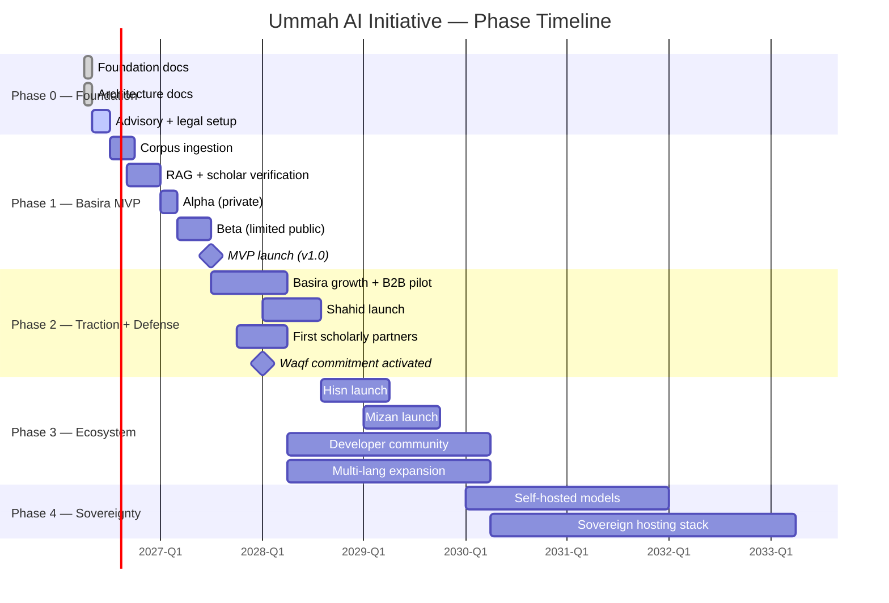
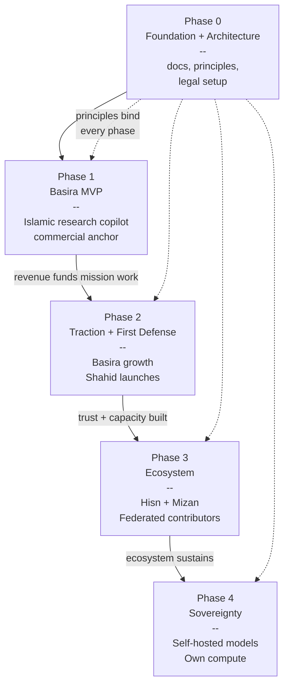
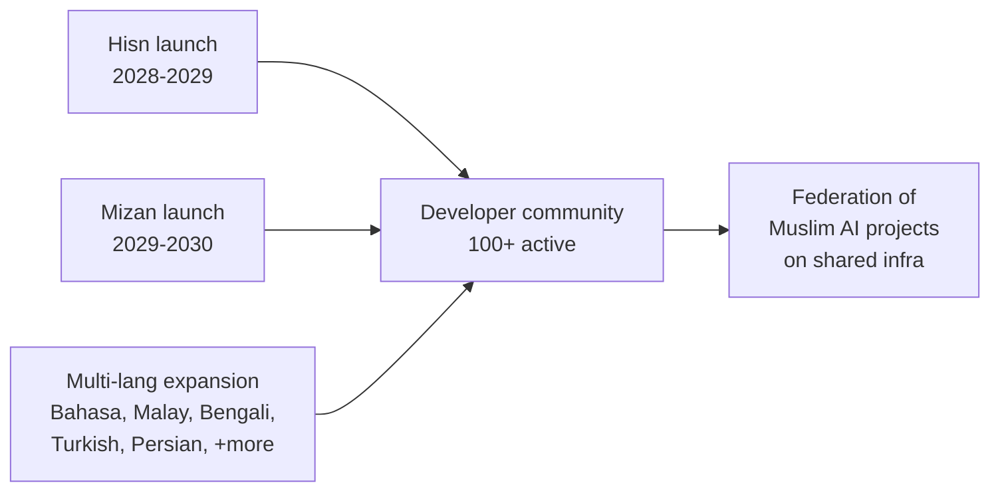
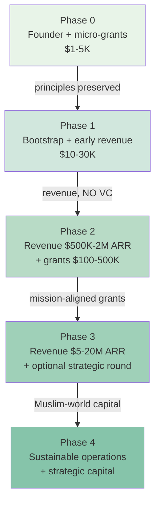
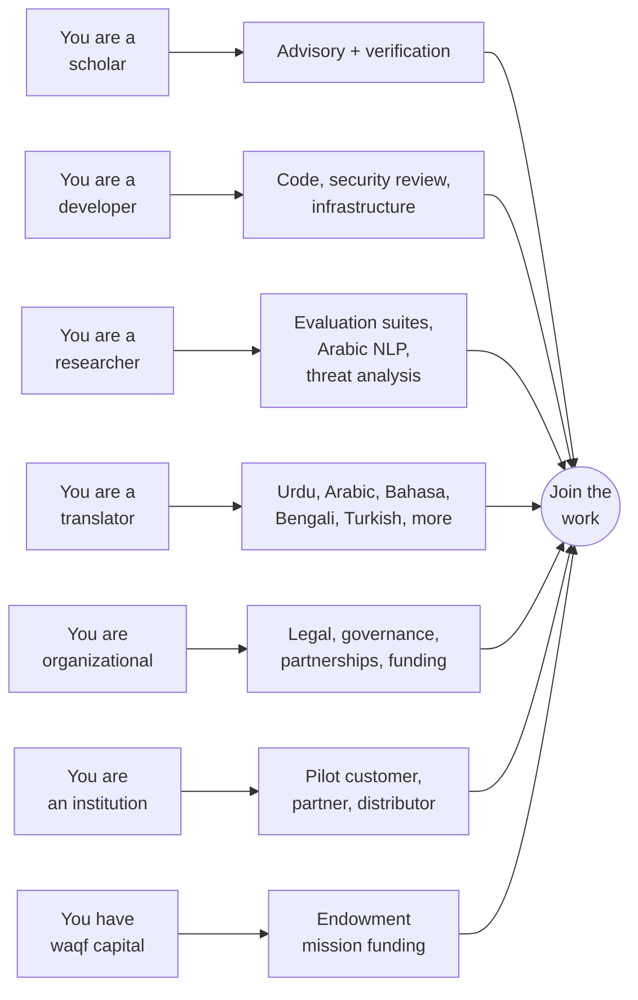

# Roadmap

## The Plan, at a Glance

A multi-generational project, but with concrete phase-gates along the way. This document shows **where we are, where we're going, and how we get there**, with the caveat that every timeline is a planning scaffold — not a commitment.

> **Current status (April 2026):** Phase 0 — Foundation + Architecture documents complete. Implementation begins in Phase 1.

---

## One-screen view

```
            2026 ── 2027 ── 2028 ── 2029 ── 2030 ─────────►  decades

Phase 0  ██░░
    Foundation + Architecture (docs only)

Phase 1       ████░░
    Basira MVP                       (commercial anchor ships)

Phase 2             ████░░
    Traction + First defensive project (Shahid launches)

Phase 3                    ████████░░
    Ecosystem (Hisn + Mizan + federated contributors)

Phase 4                              ████████████►
    Infrastructure sovereignty        (self-hosted models, compute, jurisdiction)
```

See [`docs/05-strategy.md`](docs/05-strategy.md) for the strategic reasoning behind this sequencing.

---

## Mermaid timeline (GitHub renders this)



---

## Phase map (dependencies)



Every later phase depends on the earlier one. And every phase remains bound by the Phase-0 principles — no phase gets to re-open the non-negotiables.

---

## Project portfolio evolution

Each of the four projects has its own maturation curve. They don't all launch at once — the strategy is **quwwat first, hifazat follows** (see [`docs/05-strategy.md`](docs/05-strategy.md)).

```
               Phase 0   Phase 1   Phase 2   Phase 3   Phase 4
               2026      2026-27   2027-28   2028-30   2030+
               ───────────────────────────────────────────────
BASIRA         design    BUILD     LAUNCH    scale     sovereign
(research)     ░░░░░░   ████████  ████████  ████████  ████████
                         ┌────────── revenue ──────────┐
                         │                             ▼
SHAHID         sketch    ·         DESIGN    BUILD     scale
(archive)      ░░░░░░   ░░░░░░    ████░░░░  ████████  ████████

HISN           sketch    ·         ·         BUILD     scale
(defense)      ░░░░░░   ░░░░░░    ░░░░░░    ████████  ████████

MIZAN          sketch    ·         ·         BUILD     scale
(audit)        ░░░░░░   ░░░░░░    ░░░░░░    ██████░░  ████████
```

### Why this sequencing?

- **Basira first** because it's the commercial anchor. Without revenue and distribution, the defensive projects have no funding base.
- **Shahid second** because documentation infrastructure has the clearest technical path and the highest immediate defensive value.
- **Hisn third** because it requires partnership infrastructure that Phase 2 builds.
- **Mizan fourth** because rigorous platform auditing requires methodology maturity and legal-counsel capacity that Phase 3 produces.

If circumstances change — a funder wants to accelerate Hisn, a major Shahid-relevant event emerges, a platform opens new audit access for Mizan — the sequence can adjust. The principles don't.

---

## Phase 0 — Foundation + Architecture (April 2026 — ~July 2026)

**Goal:** Establish an un-drift-able foundation. No code. No rushing.

### Completed (✅)

- [x] Foundation documents (11 files)
  - README, MANIFESTO, PRINCIPLES, CODE_OF_CONDUCT, CONTRIBUTING
  - AI_INSTRUCTIONS, GLOSSARY, SECURITY, PRIVACY, LICENSE
- [x] `docs/` — 9 documents covering why, history, disclosure, projects, strategy, governance, non-negotiables, threat model, content policy
- [x] `architecture/` — 12 documents: cross-project overview, 17 ADRs, data architecture, security architecture, Basira deep design, sketches for Shahid/Hisn/Mizan
- [x] Public GitHub repository — openly auditable from day one

### In progress (🔄)

- [ ] **Initial scholarly advisory** — reach 5-10 scholars across Sunni / Shia / Ibadi / major madhahib
- [ ] **Legal entity formation** — counsel engaged, jurisdiction selected (UAE / Malaysia / Estonia candidates)
- [ ] **Trusted continuators** — bus-factor group of 3 people with repo admin + documented succession
- [ ] **Funding track-1** — initial grant applications for mission work (digital rights foundations)
- [ ] **Domain + infrastructure** — `ummah-ai.org` or similar; email; initial Hetzner account

### Exit criteria for Phase 0

- Foundation + architecture published publicly ✅
- 5+ scholars signed on to advisory
- Legal entity incorporated, counsel on retainer
- 3 trusted continuators with documented roles
- 1-3 seed partnerships with established digital rights / Islamic scholarly orgs

### Budget

Founder time + ~$1-5K out-of-pocket (domain, legal, initial infra).

---

## Phase 1 — Basira MVP (mid-2026 — mid-2027)

**Goal:** Ship a narrow-but-excellent Islamic research copilot. Prove the model.

### Workstream 1: Corpus ingestion

```
Q3 2026  ────────────►  Q4 2026  ────────────►  Q1 2027
Quran (complete)        Hadith Sunni (6 + Muwatta)    Shia hadith (4 + Nahj al-Balagha)
Translations            Initial tafseer (Ibn Kathir,  Initial fiqh coverage (focused)
Arabic normalization    al-Mizan, + 1 contemporary)   Ibadi where available
```

### Workstream 2: RAG + UX

```
Q3 2026  ────────────►  Q4 2026  ────────────►  Q1 2027
Hybrid retrieval        Citation enforcement         Multi-school representation
Arabic NLP pipeline     Refusal policies             School-filter UX
Evaluation suite v1     Eval suite v2                High-threat mode
```

### Workstream 3: Scholar verification

```
Q4 2026  ────────────►  Q1 2027  ────────────►  Q2 2027
Scholar onboarding      Review workflow operational  Cross-school review flows
Compensation structure  First verified content       Periodic re-review cadence
Diversity targets       Transparency of reviews
```

### Workstream 4: Go-to-market

```
Q1 2027  ────────────►  Q2 2027  ────────────►  Q3 2027
Private alpha           Limited public beta          MVP v1.0 launch
  (20-50 invites)         (1-5 institutional pilots)  Free tier + Plus tier
```

### Exit criteria

See [`architecture/basira/04-mvp-scope.md`](architecture/basira/04-mvp-scope.md) for the full checklist. Key ones:

- Evaluation suite passes on correctness, hallucination rate (zero for citations), bias, refusal
- Three-language UI (Arabic + Urdu + English) with full coverage
- At least 10 active verifying scholars across required traditions
- 10,000+ active users within 3 months of public launch
- 3+ paying institutional pilots signed
- Privacy, security, transparency commitments all operational

### Budget

- Out-of-pocket / bootstrap: $10-30K total.
- Primary funding: early B2B revenue + selective small grants.
- **No venture capital this phase.** Keeps mission integrity intact.

---

## Phase 2 — Traction + First Defensive Project (mid-2027 — mid-2028)

**Goal:** Prove Basira's commercial trajectory. Activate the waqf commitment. Launch Shahid.

### What changes in Phase 2

- **Basira** moves from survival-mode to growth-mode.
- **Revenue-share to mission work begins.** Per [`docs/05-strategy.md`](docs/05-strategy.md), minimum 20% of net revenue is structurally committed to Track B (defensive work) — legally binding, audited annually.
- **Shahid** launches as the first full defensive project.

### Key milestones

| Milestone | Target |
|---|---|
| Basira MRR | $5-30K/mo |
| Institutional customers | 5-20 paying |
| Waqf commitment activated and audited | by Q1 2028 |
| Shahid MVP live | by Q2-Q3 2028 |
| First Shahid documented cases | by Q3 2028 |
| At least one major human rights partnership | Phase 2 exit |
| Team size | 3-6 people |

### Funding

- Basira revenue scaling toward $500K-2M ARR.
- First meaningful institutional grants for Shahid (target: $100-500K cumulative).
- Optional: small seed round ($250K-500K) from mission-aligned Muslim angel investors if terms preserve mission integrity.

---

## Phase 3 — Ecosystem (mid-2028 — 2030)

**Goal:** Move from a single organization to a genuine ecosystem. Other builders contribute. Other Muslim AI companies emerge on shared infrastructure.

### Key milestones



### Concrete targets

- **Hisn** live with documented users protected, counter-surveillance tooling distributed.
- **Mizan** publishing quarterly platform accountability reports.
- **Developer community:** 100+ active contributors across projects.
- **Languages:** MVP 3 languages expanded to 8-10.
- **Basira ARR:** $5-20M.
- **Other commercial products** built on our open infrastructure by third parties (the real ecosystem test).
- **Scholarly advisory:** 30+ scholars across all major traditions, paid equitably.

### Funding

- Basira revenue sustains core operations.
- Seed round possibly followed by a larger strategic round from mission-aligned Gulf / Malaysian / Indonesian capital (Phase 3 is when this is appropriate, if at all).
- Ecosystem grants support broader developer community.

---

## Phase 4 — Infrastructure Sovereignty (2030 onward)

**Goal:** Reduce structural dependence on non-sovereign infrastructure. Long-horizon, civilizational.

### What this looks like (loose sketch, not commitments)

- **Self-hosted frontier-quality models** for Muslim-world use cases — classical Arabic specifically — either trained by us or fine-tuned from open models with our proprietary scholarly data.
- **Sovereign hosting backbone** — Muslim-world datacenter partnerships, reducing dependence on US hyperscalers.
- **Compute capacity** for serious AI work owned within the Ummah ecosystem.
- **Policy infrastructure** — OIC-level, national-government-level engagement to standardize Muslim-serving AI practices.

Phase 4 depends heavily on what has emerged by 2030 externally (Gulf sovereign AI initiatives, Malaysian/Indonesian capacity, political developments). We start planning it in Phase 3 so we are ready to act when opportunities arrive.

---

## Funding timeline overlay



**Explicitly refused at every phase:**

- Capital with control strings that compromise principles
- Capital from entities with documented civilian-targeting records
- Non-disclosure requirements that conflict with transparency

See [`docs/05-strategy.md`](docs/05-strategy.md) for the full funding posture.

---

## Milestones and exit gates

Each phase has **exit gates** — criteria that must be met before declaring the phase complete. This is different from "time elapsed." A phase ends when it has achieved what it was meant to achieve, not when the calendar says so.

### Phase 0 exit gate

```
┌─ Foundation docs published ─────── ✅
├─ Architecture docs published ───── ✅
├─ 5+ scholars on advisory ────────  ⏳
├─ Legal entity + counsel ─────────  ⏳
├─ 3 trusted continuators ─────────  ⏳
├─ Public repo + contribution flow ─  ⏳
└─ 1-3 seed partnerships ──────────  ⏳
```

### Phase 1 exit gate (Basira MVP)

```
┌─ Core corpus ingested + verified ─  ⏳
├─ Evaluation suite passing ────────  ⏳
├─ Scholar verification operational   ⏳
├─ 3-language UI complete ─────────   ⏳
├─ Free + Plus tiers operational ──   ⏳
├─ 10,000+ users ──────────────────   ⏳
├─ 3+ paying institutional pilots ─   ⏳
├─ Transparency + privacy live ────   ⏳
└─ Security review complete ───────   ⏳
```

### Phase 2 exit gate

```
┌─ Basira stable revenue + growth ─   ⏳
├─ Waqf commitment activated+audited  ⏳
├─ Shahid MVP live ────────────────   ⏳
├─ First Shahid documented cases ──   ⏳
├─ 1+ HR-org partnership ──────────   ⏳
└─ Team scaled to 3-6 people ──────   ⏳
```

### Phase 3 exit gate

```
┌─ 4+ projects active ──────────────  ⏳
├─ 100+ developer contributors ────   ⏳
├─ Hisn, Mizan in operation ───────   ⏳
├─ Multi-language (8-10) coverage ─   ⏳
├─ Documented policy impact ───────   ⏳
└─ Federated ecosystem emerging ───   ⏳
```

---

## Risk triggers (when plans slow, not stop)

If any of these happen, we adjust pace and scope — we do **not** compromise principles.

| Trigger | Response |
|---|---|
| Scholar-review throughput insufficient | Narrow corpus scope at MVP; invest in scholar recruitment earlier |
| Technical blockers in classical Arabic NLP | Extend Phase 1 timeline; do not ship inferior quality |
| Funding shortfall | Slow team growth; prioritize sustainable revenue over growth |
| Legal / jurisdictional complication | Migrate infrastructure; this is why we designed for portability |
| Major external event (regulatory, platform change, conflict) | Re-prioritize within the roadmap; publicly explain why |
| Key-person unavailability (founder, advisor) | Activate bus-factor protocol per [`docs/06-governance.md`](docs/06-governance.md) |

### What we will NOT do under pressure

- Ship misleading Islamic content to hit a deadline.
- Accept capital that requires principle compromise.
- Silently close something that was supposed to be open.
- Quietly open something that should be closed.
- Expand scope without the capacity to do it well.

See [`docs/07-non-negotiables.md`](docs/07-non-negotiables.md).

---

## How you can help

This is a civilizational project. It needs many hands. See [`CONTRIBUTING.md`](CONTRIBUTING.md) for details, but in summary:



Open an issue. Open a pull request. Open a conversation.

---

## Change control for this roadmap

This roadmap is living. Timeline estimates will drift. Phase definitions may tighten or broaden. Projects may be added or retired.

- **Minor updates** (date refinements, milestone rewording): via pull request, maintainer approved.
- **Material changes** (phase definitions, exit criteria, project prioritization): public proposal, minimum one-week discussion period, governance review per [`docs/06-governance.md`](docs/06-governance.md).
- **Principle-level changes**: not possible via roadmap update. Changes to principles follow the full governance process and generally are not permitted at all.

---

## Closing

Plans fail. Principles persist.

If this roadmap is wrong, we revise. If reality demands a different path, we walk the different path, documented openly.

But we don't revise principles to fit convenience. We revise plans to honor principles.

That is the test of this roadmap — and of every roadmap that comes after it.

*Wa ma tawfiqi illa billah.*
