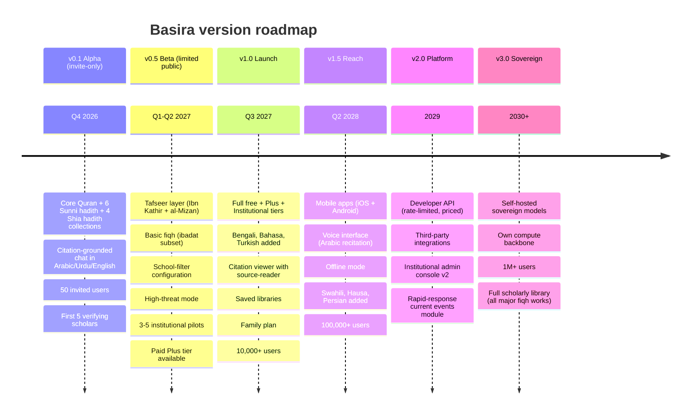
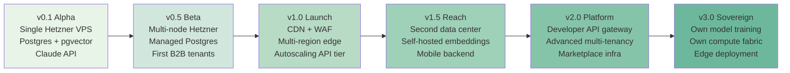

# Basira — Full Roadmap

> بَصِيرَة — *Insight*
> The first Muslim-built AI a billion users can actually trust.

---

## The 30-Second Pitch

**1.8 billion Muslims** use AI tools every day — ChatGPT, Gemini, generic search — that hallucinate hadiths, mistranslate Quran, misrepresent schools of thought, and treat classical Arabic as an afterthought. Muslim scholars watch their tradition get mangled by models trained on Reddit.

**Basira is the alternative.** A citation-grounded, scholar-verified, multi-school AI research copilot for Islam — built openly by Muslims, for Muslims, serving every school of thought.

**It is also the initiative's commercial anchor.** Basira's revenue funds everything else we build — the atrocity archive (Shahid), the counter-surveillance toolkit (Hisn), the platform auditing (Mizan). No Basira, no mission.

**You are needed.** This roadmap shows exactly what we're building, when, and where you fit in.

---

## Who This Is For

### As a user

| Persona | Pain today | What Basira gives them |
|---|---|---|
| **Imam preparing khutbah** | Hours of manual hadith verification across multiple sources | Cross-tradition verified hadith search with grading, in seconds |
| **Madrasa student** | Only textbook in front of them, no way to cross-reference | Full classical library with Arabic fidelity and Urdu/English side-by-side |
| **Convert learning Islam** | Random YouTube videos of uncertain quality | Scholar-verified answers with citations, school-by-school |
| **Muslim journalist** | No trustworthy source for Islamic context on a news story | Rapid, citation-grounded background research |
| **Islamic finance analyst** | Shariah compliance research takes weeks per product | Sharia database with fatawa from multiple authorities |
| **Hospital / prison chaplain** | Must answer complex questions on the spot with no reference | Mobile-friendly citation-ready reference |
| **Scholar doing academic research** | Digital Arabic corpus tools are fragmented and poor | Professional-grade scholarly search with full provenance |
| **Parent teaching children Islam** | No kid-safe Islamic learning tool that respects their madhhab | Family tier with age-appropriate filtering + madhhab defaults |

### As a contributor

| You are | What you build | What you get |
|---|---|---|
| **Senior dev (TypeScript/Python)** | RAG pipeline, retrieval, infrastructure | Paid role once funded; meanwhile MIT-licensed portfolio work + network |
| **ML researcher** | Arabic NLP, fine-tuning, evaluation | Publishable benchmarks (Layer 1 open); co-author on papers |
| **Scholar** | Verification, curation, advisory | **Paid** per-review + retainers; see `03-scholar-verification.md` |
| **Translator (Urdu/Arabic/Bahasa/...)** | UI + scholarly content localization | Bounties for substantive translation; named credit |
| **UX/UI designer** | User-facing interfaces that respect Muslim aesthetic + accessibility | Public portfolio work; paid contracts for specific launches |
| **Security engineer** | Privacy-preserving architecture, threat modeling | Paid security audits once funded; reputation work |
| **Student / junior dev** | Issue triage, docs, tests, small features | Mentorship + public commits + potential paid path |

---

## Product Vision — The Three-Sentence Test

We test every feature against this sentence:

> *"This feature helps a 19-year-old Muslim in [Lahore / Lagos / Jakarta / Dearborn / Cairo] access 1400 years of Islamic scholarship in their own language, with honest scholarly plurality, at a price they can afford, without their data being sold, without being lectured, and without being told which school is 'correct'."*

If a feature doesn't serve that sentence, it doesn't ship.

---

## Version Roadmap

---

## v0.1 — Alpha (Q4 2026)

### What ships

#### User-visible

- **Web app only** — no mobile yet.
- **Three supported languages:** Arabic, Urdu, English. UI in all three, content in all three.
- **Core corpus:** complete Quran, 6 Sunni hadith collections + Muwatta, 4 Shia hadith collections + Nahj al-Balagha.
- **Citation-grounded chat:** every scholarly claim links to a primary source passage.
- **Citation viewer:** click any citation → opens source with surrounding context + translations.
- **Invite-only access:** 50 users (mix of scholars, students, journalists).
- **Feedback button** everywhere — this is a beta; we listen aggressively.

#### Behind the scenes

- Hybrid retrieval (BM25 + dense embedding) operational.
- First cross-encoder reranker deployed.
- Scholar verification workflow with 5 verifying scholars across Sunni + Shia + Ibadi.
- Evaluation suite v1: correctness, hallucination, bias, refusal benchmarks.
- Observability + privacy infra complete.
- Hosting on Hetzner EU per ADR-016.

### What explicitly does NOT ship in v0.1

- Payments.
- Institutional admin console.
- Mobile apps.
- Voice.
- Additional languages.
- Fiqh corpora (initial version is Quran + Hadith focused).
- Public sign-ups (invite only).

### Success criteria for v0.1

- 50 alpha users give substantive feedback over 30 days.
- Evaluation suite shows zero hallucinated citations in 500-query test set.
- At least 3 of 5 verifying scholars publicly endorse their tradition's content.
- Foundation advisory council reviews alpha and approves move to v0.5.

### Who we need to ship v0.1

- 1 primary maintainer (founder + 1-2 collaborators) full-time or near-full-time.
- 5 verifying scholars (paid retainers).
- 2-3 part-time contributors (Arabic NLP, UI, evals).
- Occasional: legal counsel, accountant.

---

## v0.5 — Beta (Q1-Q2 2027)

### What adds on top of v0.1

#### User-visible

- **Tafseer layer** — Ibn Kathir, al-Mizan, + 1 contemporary scholar's work. Searchable, cross-referenced with Quran verses.
- **Fiqh subset** — focused practical coverage (wudu, salah, fasting, zakat basics) across Hanafi, Maliki, Shafi'i, Hanbali, Ja'fari.
- **School-filter configuration** — user can set "Shafi'i-first view" or stay full-spectrum; always visible which is active.
- **High-threat mode** — activated per-session; no server-side logs; client-side only state.
- **Saved passages** — bookmark content for later.
- **Multi-turn sessions** — conversational follow-ups preserve context.
- **Limited public signups** — waitlist; growing by inviting tranches.
- **Paid Plus tier** — available to signed-up users; pricing detailed below.

#### Behind the scenes

- First 3-5 **institutional pilots:** likely a mix of:
  - 1 Islamic university (full-semester pilot with students)
  - 1 madrasa network (multi-campus)
  - 1 Islamic-finance firm (Shariah-compliance use case)
  - 1 chaplaincy program (hospital or prison)
  - 1 Islamic education platform (content partnership)
- Payment infrastructure (Stripe) operational.
- Institutional admin console v1 (simple): user management, school defaults.
- Arabic morphological analyzer integrated (root-aware search).
- Evaluation suite v2: expanded benchmarks, multilingual coverage.
- 15+ verifying scholars.

### Monetization — first revenue

**Plus tier (individual, B2C):**

- Target: $5 USD / month globally, with regional pricing (lower in Pakistan, Bangladesh, Indonesia, Egypt, Nigeria).
- What's included: higher daily query limits, saved libraries, multi-turn context, export, priority latency.
- Free tier remains genuinely usable — not a "free-trial" teaser.

**Institutional pilots (B2B):**

- Tiered pricing based on user seats and customization needs.
- Rough ranges:
  - Madrasa / small institution: $50-200 / month.
  - University department: $500-2,000 / month.
  - Islamic bank / fintech: $2,000-20,000 / month (enterprise terms).
- Pilots are discounted / free for first 6 months in exchange for feedback and case studies.

**Revenue target exit of v0.5:**
- $3-10K MRR
- 1-3 paying institutional customers

### Who we need to ship v0.5

- 3-5 part-time or full-time team members.
- 15 verifying scholars on retainer.
- Design capacity (for the admin console and institutional UX).
- Legal capacity (for institutional contracts, pilot agreements).

---

## v1.0 — Public Launch (Q3 2027)

### What ships at launch

#### User-visible

- **Full free tier + Plus tier + Institutional tier** — all live simultaneously.
- **6 languages:** Arabic, Urdu, English, Bengali, Bahasa, Turkish.
- **Source-reader** — a beautiful, accessible interface for reading classical texts with:
  - Arabic original in canonical script
  - Side-by-side translations
  - Inline scholarly commentary
  - Grading (for hadith)
  - Cross-references visible on side
  - Dark mode
  - Reading progress tracking
- **Family plan** — up to 5 accounts with optional parental controls for children.
- **Institutional admin console v2** — proper admin tools: user management, roles, analytics (privacy-preserving — admin sees aggregate usage, not individual queries), school configuration, custom glossaries, invoicing.
- **Public evaluation dashboard** — our own benchmark scores visible to the public. Radical transparency.
- **First Transparency Report** — annual publication covering user count, revenue, operations, mission allocation.

#### Behind the scenes

- **Autoscaling infrastructure** — can handle 10x current load without pager duty.
- **Full CI/CD pipeline** for safe iteration.
- **External security audit completed** and findings resolved.
- **Waqf revenue commitment legally binding** — 20% floor audited.
- **Legal entity fully operational** — partnerships, contracts, banking, insurance.

### Success criteria for v1.0

- 10,000+ active users (MAU).
- $20-50K MRR.
- 5-15 paying institutional customers.
- 25+ verifying scholars.
- Measurable NPS / satisfaction among scholars, institutional users, and individual users.
- Public evaluation benchmarks meet published thresholds.
- Transparency Report published on schedule.

---

## v1.5 — Reach (2028)

### What expands in v1.5

#### User-visible

- **iOS and Android native apps** — not mobile web, actual native apps with offline support.
- **Voice interface** — ask questions verbally; hear Quranic recitation correctly pronounced; listen to answers read aloud (where culturally appropriate).
- **Offline mode** — core corpus available locally on device; queries work without internet for most scholarly lookups.
- **Swahili, Hausa, Persian** added (bringing us to 9 languages).
- **Rapid-response current events module** — when a major Islamic scholarly event occurs (e.g. a prominent scholar passes away, a major ruling is issued), relevant curated content is surfaced.
- **Community Q&A** — users can flag questions for scholar response; popular questions answered via the platform; answer quality visible.

#### Behind the scenes

- **Second data center** online for latency (Malaysia / UAE for APAC/MENA users).
- **Self-hosted embedding model** (BGE-M3 or successor) operational — reducing dependency on OpenAI for embeddings.
- **Enhanced Arabic NLP** — morphology, diacritic-aware, classical syntax parsing.
- **Scholar network:** 50+ active verifying scholars spanning 10+ countries.
- **Ecosystem ripple:** 3-5 third-party products built on Basira's open tooling.

### Monetization — growth

Revenue target at v1.5: **$500K-2M ARR**.

**Mix:**
- B2C Plus tier: ~50% of revenue
- Institutional (madaris, universities, chaplaincy, finance): ~40% of revenue
- API usage (early developer access, not full public API yet): ~10% of revenue

**New revenue streams:**
- **Corporate / SaaS integrations** — Muslim-world banks, HR platforms, halal certification bodies licensing scholarly data for internal workflows.
- **Content partnerships** — Muslim media outlets license curated scholarly content for their properties.

### Contributor growth

- **Team:** 8-15 full-time / near-full-time.
- **Paid contributors:** 20+ on various contracts.
- **Scholarly advisors:** 50+ paid scholars.
- **Volunteer open-source contributors:** 100+ PRs merged in the past year.

---

## v2.0 — Platform (2029)

### What v2.0 becomes

Basira moves from *product* to *platform*. Third parties build on Basira, not just consume it.

#### User-visible (to developers)

- **Public Developer API** — authenticated, rate-limited, usage-priced. Any developer can query scholarly sources through Basira's infrastructure.
- **SDK** in multiple languages.
- **Developer docs and examples.**
- **API marketplace** — pre-built integrations: WhatsApp bots, Slack/Teams helpers, WordPress plugins for Muslim publications, LMS connectors for madaris.

#### Institutional

- **Admin console v3** — white-label options, custom branding for large institutions, SSO (SAML/OIDC), custom scholarly glossaries, per-institution fine-tuning on their curricula.
- **Chaplaincy program partnership** — hospitals, prisons, military chaplaincy at scale.
- **National Muslim education integrations** — public curriculum licensing deals in Muslim-majority countries.

#### Governance

- **Advisory council expanded** — 20+ scholars across traditions.
- **Community council** — elected representatives per `docs/06-governance.md` Phase G2.
- **First board of trustees** including mission guardians.

### Monetization at v2.0

Revenue target: **$5-20M ARR**.

Streams:
- B2C Plus (+ Family): ~30%
- Institutional subscriptions: ~40%
- API / developer usage: ~15%
- Enterprise / white-label: ~10%
- Partnerships / licensing: ~5%

At this scale, the **20% mission allocation** is $1-4M / year funding Shahid, Hisn, Mizan, scholarly grants, and initial sovereignty work.

---

## v3.0 — Sovereign (2030+)

### What changes in v3.0

Basira stops depending on external frontier AI labs for the most critical capabilities.

- **Self-hosted sovereign models** — fine-tuned classical Arabic LLM trained on scholarly corpus. Either ourselves trained from an open base, or fine-tuned from a partnered Muslim-world foundation model (Jais, Fanar, Noor, or successor).
- **Compute backbone** — GPU infrastructure partnerships with Gulf / Malaysian / Indonesian sovereign tech investments.
- **Edge deployment** — Basira core can run on-device for privacy-critical deployments (activists, sensitive institutions).
- **Research output** — publish novel Arabic NLP research; contribute to Muslim-world academic AI capacity.

### Vision scale

- **1M+ MAU** across languages and regions.
- **$20-100M ARR** commercially.
- **20%+ to mission** = $4-20M / year funding the full defensive portfolio and more.
- **100+ paid scholars** + significant grant program.
- **Multiple downstream Muslim AI companies** built on Basira's open layers.

---

## Feature Backlog (Roadmap but Unscheduled)

Things we want but haven't committed to specific versions:

- **Arabic OCR / manuscript search** — photograph a classical manuscript page, search its content.
- **Quranic recitation teaching** — tajwid coaching via audio analysis.
- **Ijtihad tools** — advanced tools for qualified scholars doing their own research.
- **Integration with Islamic calendars, prayer times, compasses** (minimal — not Basira's focus, but some users will ask).
- **Whisper-mode deep research** — long-form research sessions that run for minutes producing essay-quality scholarly analysis with full citations.
- **Scholar profile pages** — public profiles of verifying scholars so users can follow specific scholars' verified contributions.
- **Question queuing for live scholars** — asynchronous "ask a scholar" feature for paid users (scholars paid per question).

---

## Competitive Landscape

### Who else tries this

| Player | What they do | Why Basira is different |
|---|---|---|
| **IslamQA / Islamweb / Islamonline** | Static fatwa databases, mostly Salafi / Hanbali | Single-school; no AI; no multi-tradition balance |
| **Yaqeen Institute** | Research articles, essays, educational content | Content-first, not AI tool; one methodology |
| **Tafsir.app, Quran.com** | Quran display + translations | Narrow scope; no AI reasoning; no hadith/fiqh |
| **ChatGPT / Gemini on Islam** | General LLM answering Islamic questions | Hallucinates; no citation grounding; no scholarly verification; no plurality |
| **Fanar / Jais / Noor** | Arabic LLMs from Muslim-world institutions | Foundation models, not products; don't build scholarly RAG; Basira can ride on top of them |
| **Existing "Islamic AI apps"** | Usually ChatGPT wrappers marketed as Islamic | Same problems as ChatGPT; no verification; often single-school |

### Why Basira wins

- **Trust:** auditable scholar verification; multi-tradition by default.
- **Quality:** citation-enforced; zero hallucinated citations policy; public benchmark scores.
- **Completeness:** actual scholarly corpus, not an LLM hallucinating from training data.
- **Distribution:** Muslim-world marketing networks, ulama endorsements, institutional pilots.
- **Mission moat:** no major AI lab can authentically build this; their incentives diverge.
- **Values:** privacy-first, non-sectarian, not-for-sale — these are not marketing features, they are structural commitments.

---

## Deployment / Infrastructure Evolution

At every stage we maintain:

- **Portability** — can migrate off any single provider.
- **Data residency** — Layer 4 data stays EU (Hetzner) per ADR-016.
- **Observability** — self-hosted Grafana stack.
- **Zero-retention LLM contracts** where external APIs are used.

---

## Risk Register (Basira-specific)

| Risk | Probability | Mitigation |
|---|---|---|
| Scholar verification bottleneck | High | Start recruiting Phase 0; fair compensation; concurrent scholars per tradition |
| Classical Arabic NLP underdelivers | Medium | Budget time for iteration; use scholarly review to flag errors; benchmark publicly |
| Free tier cost grows faster than revenue | Medium | Fair daily limits; abuse detection; upgrade prompts when limits hit |
| Institutional sales cycle too long | High | Start pilot conversations in v0.1; have 5+ in pipeline by v0.5 |
| Cultural backlash ("AI fatwa" fear) | Medium | We do NOT issue fatawa; explicit refusal UX; scholarly advisory visibility |
| Platform competition from frontier labs | Low but high-impact | Trust + scholarly network can't be replicated by OpenAI/Google |
| Burnout / key-person risk | Medium | Sustainable pace; bus-factor from Phase 0; no hero-mode culture |
| Adversarial attacks (prompt injection, scraping) | Medium | Security architecture; abuse detection; see `10-security-architecture.md` |

---

## Why Contributors Should Join

### If you are a Muslim developer

This is your chance to build the single most-used Muslim-built piece of software in the world. Not one of many wrappers — the one Muslims will actually trust, used by imams, students, scholars, parents.

Your commits will be in the permanent record. Your MIT-licensed work is yours forever — build your own commercial products on top if you want; we welcome that. The infrastructure you build is something the Ummah needed, not another tracking app.

### If you are a non-Muslim developer who cares

You do not need to be Muslim to contribute. The Quran and the Prophet, peace be upon him, collaborated with non-Muslims on matters of mutual benefit — the Constitution of Medina is one of the oldest pluralistic founding documents in the world. If you care about a world where a billion people have access to trustworthy tools in their own languages, and where AI serves rather than extracts — you are welcome.

### If you are a scholar

Your scholarship reaches people you will never meet. Students in Dearborn ask your verified content; a chaplain in Karachi finds your notes at 3 AM; a new convert in Lagos reads your translation. You are compensated fairly. Your work is attributed. Your voice is one among many — no school is privileged over others.

### If you are a researcher

Published benchmarks. Open datasets. Papers co-authored with us. Reference to your contributions in grant applications. Network of scholars and technologists. This is rigorous work, not marketing.

### If you are operations / legal / organizational

Building a civilizational institution from scratch is rare. Your work is not generic SaaS operations — it is the substrate of an Ummah-serving institution meant to last decades. The challenges (jurisdictional strategy, partnerships, governance) are unusual and consequential.

### In all cases

- No one is extracted from (see `FINANCIAL_MODEL.md`).
- Founder's return is capped; majority of value flows to mission.
- The entity is not for sale — your work cannot be sold from under you.
- Paid paths exist. Unpaid contribution gets MIT + attribution + network + reference value.

---

## How to Join

See [`../../CONTRIBUTING.md`](../../CONTRIBUTING.md).

For Basira-specific work:

1. **Pick an issue** from the Basira project board once work begins, or propose one.
2. **Small PR first** to establish the working relationship.
3. **Scale up** as trust builds — bigger features, paid contracts, full-time roles.

For scholars: outreach is proactive (we reach out to scholars rather than expecting them to find us), but you are welcome to contact the initiative directly.

For institutional partners: contact through the initiative's public channels once the legal entity is operational.

---

## Cross-References

- Product overview: [`01-overview.md`](01-overview.md)
- RAG pipeline: [`02-rag-pipeline.md`](02-rag-pipeline.md)
- Scholar verification: [`03-scholar-verification.md`](03-scholar-verification.md)
- MVP scope: [`04-mvp-scope.md`](04-mvp-scope.md)
- System overview: [`../01-system-overview.md`](../01-system-overview.md)
- Tech stack: [`../02-tech-stack-decisions.md`](../02-tech-stack-decisions.md)
- Financial model: [`../../FINANCIAL_MODEL.md`](../../FINANCIAL_MODEL.md)
- Main roadmap: [`../../ROADMAP.md`](../../ROADMAP.md)

---

## Closing

Basira is the commercial anchor, but more than that — it is the most visible test of whether the initiative's principles produce actually useful software. If Basira doesn't earn user love, the theory about Muslim-built AI is unvalidated.

We intend to earn it.

*Wa Allahu a'lam.*
