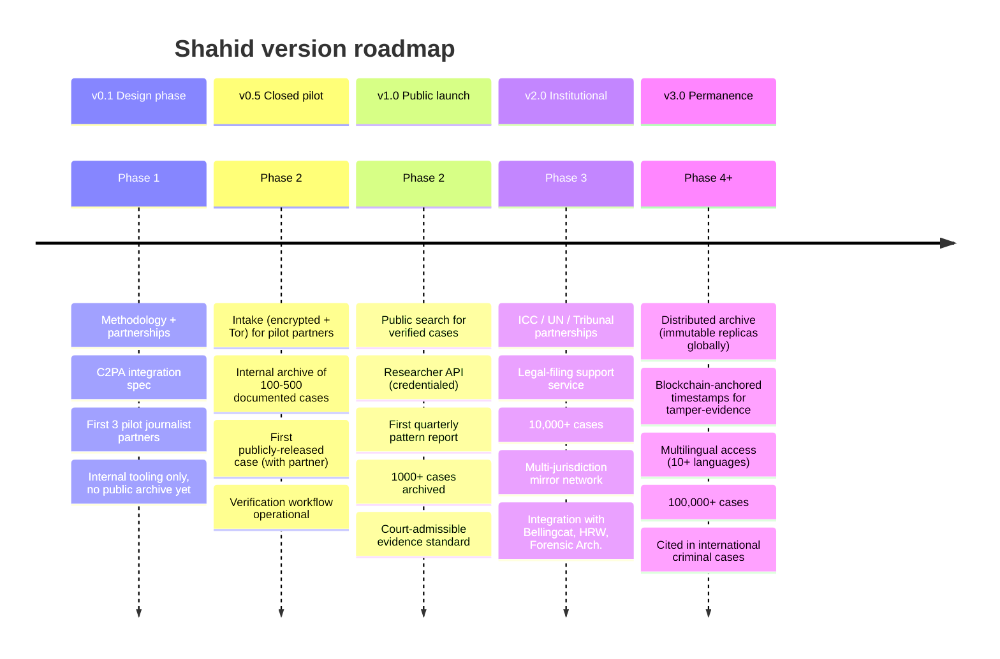
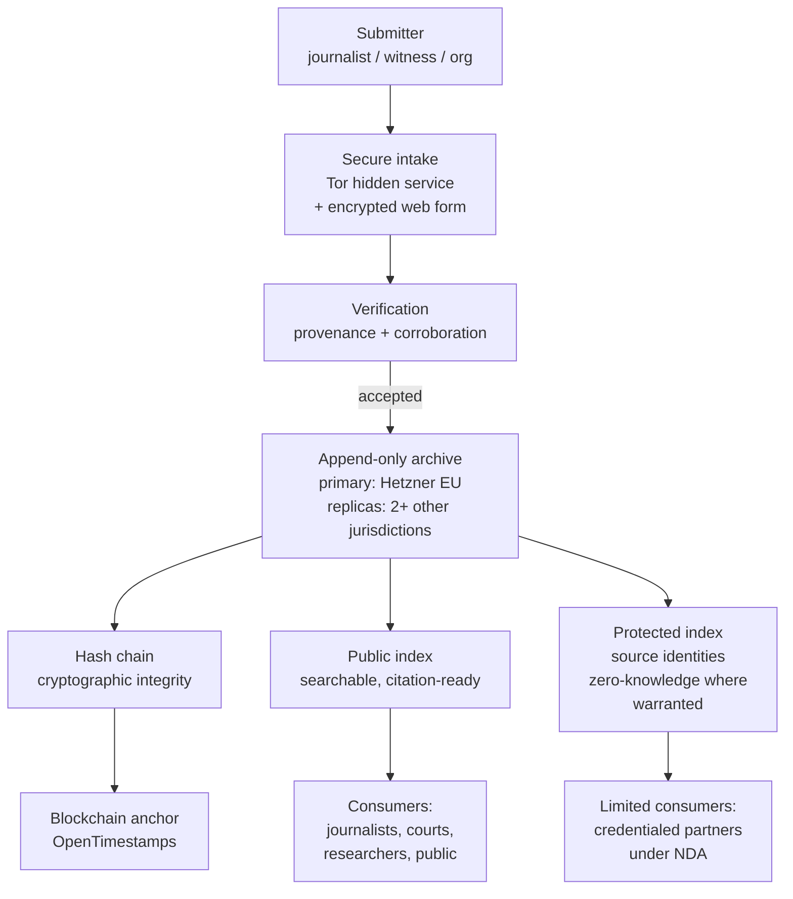

# Shahid — Full Roadmap

> شَاهِد — *Witness*
> When AI drops a bomb, someone has to remember.

---

## The 30-Second Pitch

In April 2024, Israel used an AI system called **Lavender** to generate kill lists in Gaza — marking tens of thousands of Palestinians, with human review time measured in seconds per target. Children died in their homes because an algorithm said so.

China runs **facial recognition tuned for Uyghurs.** The US armed the Taliban with biometric databases. Meta's algorithms quietly disappear Palestinian journalism. Deepfakes ruin the lives of Muslim women and journalists daily.

**And there is no archive.** No permanent, cryptographically-verified record of these harms. When journalists publish, the evidence scatters. When cases die in court, the facts fade. When perpetrators deny, no neutral record contradicts them.

**Shahid fixes that.** A permanent, tamper-evident, multi-jurisdiction archive of AI-driven harms against civilians — built to outlast governments, corporations, and us. Used by journalists, lawyers, researchers, and courts. Proof that cannot be erased.

**This is not a commercial product.** Shahid is grant-funded and waqf-funded, subsidized by Basira revenue. Its value is measured in testimony, not subscriptions.

**You are needed.** This roadmap shows what we build, phase by phase.

---

## Who This Is For

### As a user / consumer of the archive

| Persona | What they do today | What Shahid gives them |
|---|---|---|
| **Investigative journalist** covering AI-driven conflict | Fragmented leaks, time-consuming verification, lost documents | Centralized, verified, citation-ready archive with provenance |
| **Human rights lawyer** building a case | Evidence scattered across platforms that may remove it | Permanent, timestamped, cryptographically-signed evidence |
| **Academic researcher** studying AI harm | Pieced-together case notes from journalism | Structured dataset with methodology + reproducibility |
| **Policy advocate** pushing for regulation | Anecdotes that opponents dismiss | Quantified, documented pattern evidence |
| **ICC / UN investigator** preparing documentation | No dedicated tooling for AI-harm cases | Evidence workflow tuned for AI-accountability |
| **Future generations** studying our era | Fragmented historical record | Preserved, searchable, contextualized memory |

### As a contributor

| You are | What you build | What you get |
|---|---|---|
| **Backend / archival systems engineer** | Archive infrastructure, replication, provenance pipelines | Paid role (grant-funded); unusual systems-design experience |
| **Cryptographic engineer** | Content provenance (C2PA), signing, tamper-evident logs | Published implementation of hard protocols; research value |
| **OSINT researcher** | Submission verification, corroboration workflows | Named attribution on reports; network of journalists and HR orgs |
| **Legal / paralegal** | Evidence standards, chain-of-custody design | Reference experience for legal career |
| **Frontend engineer** | Public search interfaces, researcher dashboards | Work that shows up in citations |
| **Survivor / witness community liaison** | Intake design, protection protocols | Paid role; critical work for a vulnerable constituency |

---

## Product Principle — The Three-Sentence Test

We test every Shahid feature against this sentence:

> *"This feature makes it harder for a perpetrator of AI-driven civilian harm to deny what happened, without putting a witness, source, or submitter in additional danger."*

If a feature doesn't serve that sentence, it doesn't ship.

---

## Version Roadmap

---

## v0.1 — Design Phase (Phase 2 beginning — late 2027)

### What ships

#### Internal

- **Methodology document** — what kinds of harm we archive, what evidence standards we require, how verification works. Published publicly as Layer 1 open content.
- **C2PA integration spec** — how we apply content provenance to submissions; harmonized with adjacent projects (Content Authenticity Initiative, Project Origin).
- **Submission intake protocols** — for pilot partners only. Encrypted channel + Tor hidden service.
- **Case schema** defined per `01-overview.md` (expanded).
- **First 3 pilot journalist / HR-org partners** engaged. Possibly: 7amleh (Palestine), +972 Magazine, Forensic Architecture, or similar.

#### What does NOT ship in v0.1

- Public archive (not yet — we're validating the workflow first).
- Automated intake from public.
- Search interfaces.
- Reports.

### Success criteria for v0.1

- 10-20 cases documented with full provenance chain as proof of concept.
- 3 pilot partnerships signed.
- Methodology peer-reviewed by at least 2 established human rights organizations.
- Legal counsel has validated evidence standards meet international human rights / journalism norms.

### Who we need for v0.1

- 2-3 core engineers (archival systems, crypto).
- 1 investigative lead (coordinates with journalists).
- 1 legal advisor (evidence standards).
- Grant funding in place ($100-300K initial).

---

## v0.5 — Closed Pilot (2028)

### What adds on top of v0.1

#### User-visible (to pilot partners only)

- **Secure submission portal** — web + Tor hidden service. Partners submit evidence with full metadata, attachments, narrative.
- **Verification workflow** — triage → corroboration → flagging → publication decision. Dashboard for partners to track submission status.
- **Internal search and browse** — partners can explore the archive for related cases when investigating new ones.
- **Export for journalism / legal use** — citation-formatted bundles for specific investigations.

#### Behind the scenes

- **Archive replication** — primary (Hetzner EU) + 2 replica sites (different jurisdictions).
- **Append-only storage** with cryptographic hash chain.
- **C2PA fully integrated** for media artifacts.
- **Zero-knowledge intake** for highest-sensitivity submissions — when partner submits with sensitivity flag, submitter-identifying metadata is encrypted to keys only the partner holds; Shahid stores the case but can't de-anonymize the submitter.

#### Public-facing (limited)

- **First publicly-released case** — in collaboration with a pilot partner. Full methodology visible. Proof that the system works.
- **Annual methodology update** published.

### Success criteria for v0.5

- 100-500 cases in archive (mix of historical and contemporary).
- 5+ pilot partnerships producing active submissions.
- First major news story using Shahid as a source.
- Legal panel review: archive's evidence meets court-admissibility standards in at least one jurisdiction.
- Funding runway secured for v1.0.

---

## v1.0 — Public Launch (2028)

### What ships

#### Public

- **Public search and browse** — anyone can search the archive. Free.
- **Case detail pages** — structured presentation of each documented case: what happened, evidence, corroboration, citations, how to use this in journalism/law.
- **Researcher API** — credentialed for academics, journalists, legal researchers. Programmatic access for large-scale analysis.
- **First quarterly Pattern Report** — aggregate analysis of patterns in archived cases. Published openly; press-ready formats.
- **Methodology documentation** — fully public, peer-reviewable.
- **Case citation format** — standardized, ready for academic + legal use.

#### Institutional

- **Partnership infrastructure** — formal MoUs with major human rights orgs (HRW, Amnesty, Access Now, 7amleh, Bellingcat).
- **Law school clinic partnerships** — students use Shahid in clinical work.

### Success criteria for v1.0

- 1,000+ documented, verified cases.
- Shahid citations in 5+ major news publications.
- Shahid citations in at least 1 academic paper.
- Shahid referenced in at least 1 legal filing.
- 10+ partner organizations.
- Open methodology validated by peer review.

### Monetization (revenue streams)

Shahid is **not commercial** in the SaaS sense, but has several funding paths:

| Source | Structure |
|---|---|
| **Digital rights foundation grants** | Open Society, Ford, MacArthur, Luminate, Omidyar |
| **Muslim philanthropic waqfs** | Dedicated mission-aligned philanthropy |
| **Research partnership grants** | Universities funding specific case studies or methodology development |
| **Basira mission-allocation (20% floor)** | Waqf-style commitment (see `FINANCIAL_MODEL.md`) |
| **Report licensing to major media** | Syndication / exclusive rights to specific investigations |
| **Expert witness / consulting** | Paid work for journalists or lawyers using Shahid evidence; hourly rates |

**Funding target v1.0:** $500K-1M annual operating budget, mix of above sources.

---

## v2.0 — Institutional (2029)

### What becomes possible

#### Legal and international

- **ICC / UN tribunal partnerships** — formal evidence pipelines where Shahid's archive is a recognized source. Chain-of-custody standards hardened.
- **Legal filing support** — team capable of preparing specific case documentation for litigation. Paralegal support. Expert declarations.
- **Cross-jurisdictional mirror network** — archive physically distributed across 3+ jurisdictions (EU + Middle East + Southeast Asia + potentially Latin America). No single government can compel deletion.

#### Integration

- **Bellingcat / Forensic Architecture integrations** — shared standards, cross-referenced datasets.
- **Academic integration** — formal relationships with 5-10 research institutions embedding Shahid as a research infrastructure.
- **Journalism integration** — partnerships with major outlets (Al Jazeera, The Guardian, Washington Post) for rapid-access research.

### Success criteria for v2.0

- 10,000+ verified cases.
- Shahid referenced in at least 1 ICC-level or UN commission proceeding.
- Shahid methodology cited as reference in academic literature.
- Multi-jurisdiction mirror network operational.
- Sustained annual budget $1-3M via multiple funding streams.

---

## v3.0 — Permanence (2030+)

### The long vision

Shahid becomes **the Mémorial for AI-driven civilian harm** — as recognized and indelible in the public record as Holocaust archives became in the mid-20th century, or as the Truth and Reconciliation Commission's record is in South Africa.

- **Tamper-evidence** anchored to public blockchains (via OpenTimestamps or equivalent) so timestamps cannot be repudiated.
- **Global mirror network** — copies in every major jurisdiction; dissolution of any operating entity does not destroy the archive.
- **Multilingual access** — 10+ languages for researchers worldwide.
- **Integrated with legal, journalistic, and academic curricula** globally.
- **Referenced as common infrastructure** in the way the Internet Archive, Wikipedia, or the Rosetta Project are now.

### Scale targets

- 100,000+ cases.
- Archive survives any single institutional failure.
- Citations in international criminal proceedings.
- Genuinely unerasable public record of AI-era harms against civilians.

---

## How the Archive Works (Technical)

Every case has:
- **Public view:** what happened, evidence, citations, corroborations.
- **Protected view:** source identities, submitter metadata — accessible only under defined conditions.
- **Integrity proof:** cryptographic hash chain + blockchain anchor.
- **Durability:** multi-jurisdiction replicas.

---

## Partnership Strategy

Shahid's value depends on **who uses it.** Not trying to be a market leader — trying to be infrastructure.

### Primary partners we actively seek

| Org type | Specific examples | Relationship |
|---|---|---|
| **Human rights org** | HRW, Amnesty, Access Now, Article 19 | MoU; mutual evidence sharing |
| **Regional advocacy** | 7amleh (Palestine), Uyghur Human Rights Project, Kashmir-focused | Submission pipelines |
| **Investigative journalism** | Bellingcat, +972, The Intercept, ProPublica | Joint investigations |
| **Academic research** | Forensic Architecture, law school human-rights clinics, digital rights labs | Methodology research |
| **Legal institutions** | International Federation for Human Rights, specific law firms with AI-harm practice | Evidence pipelines |
| **Muslim-world orgs** | Muslim Advocates (US), Islamic Human Rights Commission | Community distribution |

### Partners we do NOT take money from

Shahid's independence is its credibility. We will not accept funding from:

- Any government or military.
- Any AI company whose products we might document.
- Any corporation whose products we might document.
- Foundations whose trustees include the above with governance influence.

Independence is the product.

---

## Competitive Landscape

### Who else does AI-harm documentation

| Effort | Scope | Gap Shahid fills |
|---|---|---|
| **Bellingcat** | Open-source investigations generally | Not specific to AI harms; not a permanent archive |
| **Forensic Architecture** | Architectural + forensic evidence for human-rights cases | Project-based; not an ongoing archive infrastructure |
| **+972 / Local Call** | Israeli / Palestinian conflict reporting | Journalism, not archival |
| **Human Rights Watch reports** | Broad human rights documentation | Not AI-specific; reports age; no dedicated archive |
| **AlgorithmWatch** | European algorithmic accountability | Focus is algorithmic systems; not AI-enabled civilian harm specifically |

**Shahid's niche:** the permanent, cryptographically-verified, AI-harm-specific archive. Not competing with these organizations — serving them. They document; Shahid remembers.

---

## Risk Register (Shahid-specific)

| Risk | Probability | Mitigation |
|---|---|---|
| Legal pressure to remove specific cases | High | Multi-jurisdiction mirrors; transparent standards; legal counsel retained |
| State-level technical attack on archive | Medium | Geographic redundancy; offline backups; cryptographic integrity |
| Source compromise (submitter identified) | Medium | Zero-knowledge intake; minimal metadata; legal protection for sources |
| False or fabricated submissions | Medium | Rigorous verification methodology; corroboration requirements |
| Misuse of archive to target individuals | Medium | Access controls on protected index; review of bulk queries |
| Funding instability | High | Multiple funding streams; waqf commitment via Basira; diversified grants |
| Politicization accusations | High | Neutral methodology; strict evidence standards; transparent process |

---

## Why Contributors Should Join Shahid

### If you are an engineer

Systems that have to last decades and survive adversarial nations are rare. Append-only cryptographically-verified archives, distributed across jurisdictions, with zero-knowledge intake — these are problems most commercial software never touches. Your work is measured not in features but in whether evidence survives.

### If you are a researcher

Shahid's methodology is research. Your contributions feed published work, academic citations, and genuinely improve the state of the art in AI-harm documentation.

### If you are an investigative journalist

Shahid is infrastructure for your craft. Your investigations become more durable; your sources are better protected; your evidence becomes more resilient to "fake" accusations. You make Shahid better by using it.

### If you are a legal professional

Building the evidence infrastructure that international courts will rely on for AI-era accountability. This is foundational, career-defining work.

### If you are a witness

Sometimes you witness something that others should know but cannot say safely. Shahid is designed so that you can contribute witness without compromising your safety. Zero-knowledge intake exists specifically for you.

### If you are a supporter

Financial support of Shahid — via grants, waqf contributions, or simply amplifying its work — funds the infrastructure that makes AI-era accountability possible.

---

## How to Join Shahid

See [`../../CONTRIBUTING.md`](../../CONTRIBUTING.md).

Shahid-specific paths:

1. **Engineers:** security-sensitive work; background checks likely; mentorship pairing.
2. **Researchers / journalists:** submission partnerships; publication collaborations.
3. **Legal:** pro bono or paid legal advisory; evidence-standards review.
4. **Financial supporters:** grant applications welcomed; waqf-style commitments via the initiative's legal structure.

Because Shahid handles sensitive information, contributor onboarding is more rigorous than Basira's. This is appropriate.

---

## Cross-References

- Overview: [`01-overview.md`](01-overview.md)
- Main roadmap: [`../../ROADMAP.md`](../../ROADMAP.md)
- Threat model: [`../../docs/08-project-threat-model.md`](../../docs/08-project-threat-model.md)
- Financial model: [`../../FINANCIAL_MODEL.md`](../../FINANCIAL_MODEL.md)

---

## Closing

Shahid is the memory of an era when humans started letting algorithms decide who lives and who dies. The first generation of machines has already produced civilian harm at scale. The question is whether the record of that harm exists.

We are building the record.

*Inna lillahi wa inna ilayhi raji'un.* — *To Allah we belong, and to Him we return.*
